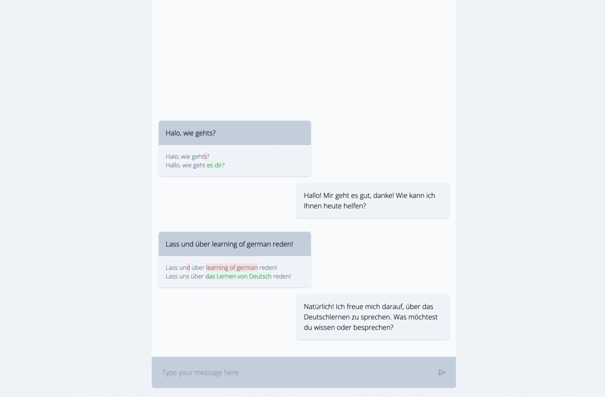

## Learning german with SRS

This is prototype of the app for learning german. It's in a chat form, it (will) have features like: 

- [x] diff between original and corrected version
- [ ] Space Repetition System, ability to store and remind the user of the phrases he learned
- [ ] guided learning path for grammar based on the current user level


[](https://youtu.be/W5-0dQhAORU)


### Details

Played with new enhanced routing patterns in Golang + htmx + tailwind. Websockets + OpenAI for the chat

For tailwind, you need to run to compile the css:
```
    make css
```

For all checks and tests, run:
```
    make ready 
```
